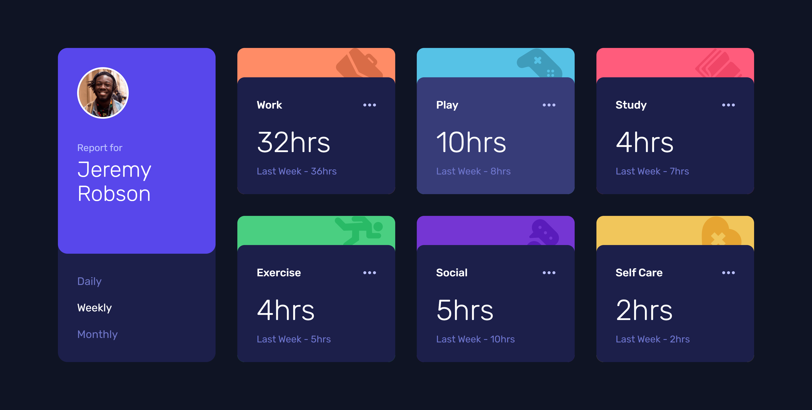

# Frontend Mentor - Time tracking dashboard solution

This is a solution to the [Time tracking dashboard challenge on Frontend Mentor](https://www.frontendmentor.io/challenges/time-tracking-dashboard-UIQ7167Jw). Frontend Mentor challenges help you improve your coding skills by building realistic projects.

## Table of contents

- [Frontend Mentor - Time tracking dashboard solution](#frontend-mentor---time-tracking-dashboard-solution)
  - [Table of contents](#table-of-contents)
  - [Overview](#overview)
    - [The challenge](#the-challenge)
    - [Screenshot](#screenshot)
    - [Links](#links)
  - [My process](#my-process)
    - [Built with](#built-with)
    - [What I learned](#what-i-learned)
    - [Continued development](#continued-development)
  - [Author](#author)

## Overview

### The challenge

Users should be able to:

- View the optimal layout for the site depending on their device's screen size
- See hover states for all interactive elements on the page
- Switch between viewing Daily, Weekly, and Monthly stats

### Screenshot

### Links

- Solution URL: [https://github.com/ShrutiShinde418/FrontendMentor7/tree/main/time-tracking-dashboard](https://github.com/ShrutiShinde418/FrontendMentor7/tree/main/time-tracking-dashboard)
- Live Site URL: [https://time-tracking-dashboard-seven-beige.vercel.app/](https://time-tracking-dashboard-seven-beige.vercel.app/)

## My process

### Built with

- Semantic HTML5 markup
- Tailwind CSS
- Flexbox
- CSS Grid

### What I learned

- Tailwind CSS
- Relative and Absolute Positioning
- How to load data from a JSON file
- JavaScript DOM Manipulation

### Continued development

- Absolute and relative positioning
- JavaScript DOM Manipulation

## Author

- Website - [Portfolio](https://portfolio-devchallenges-henna.vercel.app/)
- Frontend Mentor - [@ShrutiShinde418](https://www.frontendmentor.io/profile/ShrutiShinde418)
